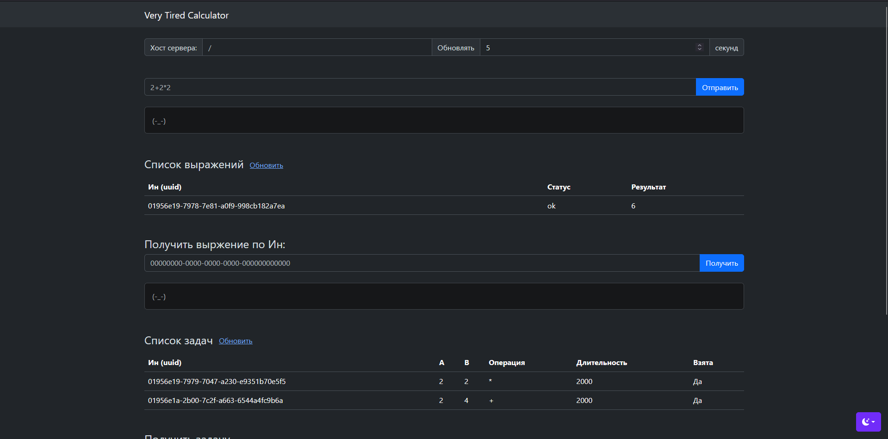
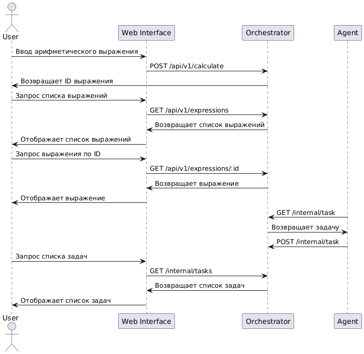

# Very Tired Calculator  (GOCACL_DISTRIBUTED)


[](https://github.com/denis-gr/GOCACL_DISTRIBUTED/actions/workflows/go.yml)

Этот ридми пишет очень уставший Денис, но несмотря на усталость, я буду рад, если тебе понравится мой калькулятор. Если будут какие-то проблемы, то пиши в тг [@denisgrigoriev04](https://t.me/denisgrigoriev04) или в [Issues](https://github.com/denis-gr/GOCACL_DISTRIBUTED/issues). Я ещё написал веб-интерфейс, поэтому если захочешь протестить, то просто запусти его, используя docker compose.

Этот калькулятор очень устал, поэтому выполняет арифметические опрации очень медлено. Поэтому он состоит из нескольких компоненов `orchestrator` и `agent`. `orchestrator` управляет распределением задач, а `agent` выполняет вычисления. Чтобы ускорить выполнения операция стоит запускать несколько `agent`, каждый агент также может считать несколько операций одновременно.





## Использование

1. Склонируйте репозиторий:
   ```sh
   git clone https://github.com/denis-gr/GOCACL_DISTRIBUTED
   cd GOCACL_DISTRIBUTED
   ```

2. Запустите проект с помощью Docker Compose:
   ```sh
   docker compose up
   ```

3. Сайт будет доступен по адресу [http://localhost/](http://localhost/)


### Примеры использования API (командная строка Linux)

- Добавление вычисления арифметического выражения:
  ```sh
  curl --location 'http://localhost/api/v1/calculate' --header 'Content-Type: application/json' --data '{ "expression": "2+2*2" }'
  ```

- Получение списка выражений:
  ```sh
  curl --location 'http://localhost/api/v1/expressions'
  ```

- Получение выражения по его идентификатору:
  ```sh
  curl --location 'http://localhost/api/v1/expressions/:id'
  ```

## Архитектура




Проект состоит из двух основных компонентов:
- `orchestrator`: управляет распределением задач и хранением результатов.
- `agent`: выполняет вычисления и отправляет результаты обратно `orchestrator`.


## Тестирование

Для запуска тестов выполните:
```sh
go test ./...
```
